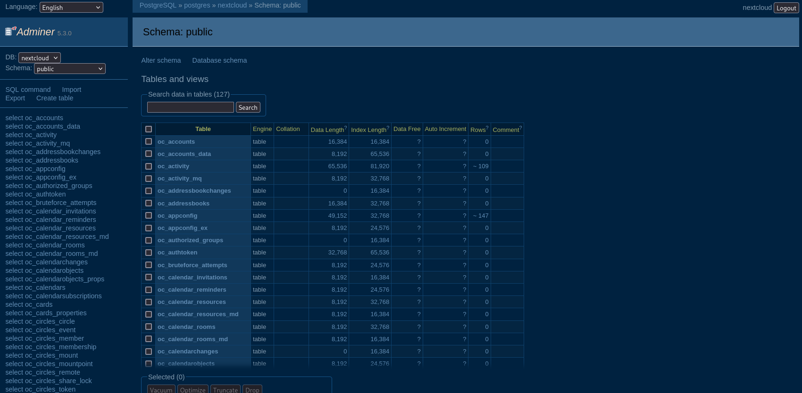

# Rendu Docker

## Le docker-compose
Il comprend un nextcloud, un service portainer, un service adminer et une bd postgress. 

Le mot de passe de la bd est défini dans le .env.

Les volumes utilisés pour la conservation des données sont définis dans les compose directement, s'ils n'existent pas déjà.

On lance tout ça avec
```
docker compose up
```


## Ça fonctionne
1. Le Nextcloud

2. Le Portainer

3. Le Adminer

4. Les volumes
(ils sont bien là)


## Conclusion
Ça fonctionne plutôt bien, j'ai eu quelques difficultés à mettre en place le compose sur NixOS mais maintenant c'est la moitié du fun de faire fonctionner tout ça. J'étais déjà familier avec le concept de définir ma config dans un seul fichier grâce à ma configuration.nix, le schéma de pensée était déjà là, il m'a suffi de m'intéresser à la syntaxe docker en plus.
